<p align="center">
  
</p>

<p align="center">
  <a href="#install"></a>
  
  
  
  
</p>

# @neevcloud/dsh-sandbox

Give your DeepSeek Harness agent a **clean, disposable Linux box** for every run.
This bundle relocates the Harness's shell work — **Bash, PTY, and LSP** — into a
short-lived, gVisor-isolated [NeevSandbox](https://neevcloud.com). Nothing runs on your
machine, and there's **nothing to fork**: drop the bundle into any `dsh`
install and the stock tools keep working, now executing remotely.

```sh
npm install --global @deepseek-ai/dsh
dsh plugin --profile headless add @neevcloud/dsh-sandbox
NEEV_API_KEY=... NEEV_ORG_ID=... NEEV_PROJECT_ID=... \
  dsh --profile headless "clone my repo, run the tests, and summarize the failures"
```

Your agent's `pwd`, `id`, files it writes, servers it starts — all live in the
sandbox, not on your laptop.

## Why

DeepSeek Harness is built on **capability seams**: swappable interfaces that
providers implement and tools consume. The Harness Bash, terminal, and LSP
tools delegate every execution-world operation to one seam — `ctx.subprocess`.
Replace that single provider and **all of them move together**, with no changes
to the tools themselves. That's the whole idea here: one small bundle, and your
agent's execution world is a remote sandbox.

> Follows the Harness [capability-seam](https://github.com/deepseek-ai/deepseek-harness/blob/master/docs/capability-seams.md)
> model and installs through the standard `dsh plugin` bundle mechanism — no
> Harness source changes, no monorepo checkout.

## How it works

```
DeepSeek Harness ──ctx.subprocess──▶ @neevcloud/dsh-sandbox ──@neevcloud/sdk──▶ NeevSandbox
  Bash · PTY · LSP                   runtime + providers                        gVisor sandbox
```

Two Cordis services, shipped as one bundle:

| Entry point | Registers | Role |
|---|---|---|
| `@neevcloud/dsh-sandbox/runtime` | `ctx.neev` | Owns one sandbox: create → ready → delete on exit |
| `@neevcloud/dsh-sandbox/subprocess` | `ctx.subprocess` | Runs processes and PTYs in that sandbox |

A shipped `cordis.patch.yml` wires them in: it disables the local subprocess
provider, inserts the two Neev rows, and sets the sandbox-aware Bash executor to
delegate straight through. `dsh plugin add` applies it for you.

## Use cases

- **Run untrusted or AI-generated code** off your machine — the blast radius is
  a disposable gVisor sandbox that's deleted when the run ends.
- **A fresh box per task.** Every `dsh` run gets its own clean Linux
  environment; no leftover state, no "works on my laptop."
- **Fan out agents in parallel**, each isolated in its own sandbox, without them
  stepping on each other's files or processes.
- **Reproducible, CI-like execution** decoupled from whatever is installed on
  the host.
- **Long-running or interactive work** — dev servers, REPLs, and TUIs run over a
  real PTY inside the sandbox.

## Install

```sh
npm install --global @deepseek-ai/dsh
dsh plugin --profile headless add @neevcloud/dsh-sandbox
```

Set your Neev credentials in the host environment (never commit them):

```sh
export NEEV_API_KEY=...      # your Neev API key
export NEEV_ORG_ID=...       # organization id
export NEEV_PROJECT_ID=...   # project id
```

Then run a task:

```sh
dsh --profile headless "use Bash to run 'cat /etc/os-release' and 'id -un', and report the output"
```

A successful run reports the **sandbox's** OS and user — not your host's — and
prints the sandbox id at both lifecycle boundaries:

```text
NeevSandbox created: <sandbox-id>
NeevSandbox terminated: <sandbox-id>
```

Verify the wiring anytime with `dsh --profile headless --dump-config`: the
`subprocess` row is disabled and the `neev-runtime` / `neev-subprocess` rows are
inserted.

### Local development install

```sh
git clone https://github.com/NeevCloudAI/dsh-neev-sandbox && cd dsh-neev-sandbox
npm install && npm run build
dsh plugin --profile headless add .
```

## Configuration

The runtime module accepts these Cordis config fields (all optional):

| Field | Default | Meaning |
|---|---|---|
| `orgId` | `NEEV_ORG_ID` | Organization id |
| `projectId` | `NEEV_PROJECT_ID` | Project id |
| `templateId` | `sb-ubuntu-26-04-minimal` | Sandbox template the server provisions from |
| `image` | — | Explicit OCI image; takes precedence over `templateId` |
| `cwd` | discovered | Absolute working directory; discovered via `pwd` when omitted |

The **API key is read only from `NEEV_API_KEY`** — it is never a config field,
so a secret can never end up in a committed profile patch, and it is never
forwarded into the sandbox.

Override a row in your profile's `cordis.patch.yml` (a patch replaces the whole
config, so restate what you need):

```yaml
- id: neev-runtime
  name: '@neevcloud/dsh-sandbox/runtime'
  config:
    templateId: sb-ubuntu-26-04-minimal
```

## Scope and limitations

- **Subprocess seam only (for now).** This release provides `ctx.subprocess`
  (Bash, PTY, LSP). The filesystem stays host-side, so the file tools and Bash
  observe different working trees until a Neev filesystem provider lands.
- **Interactive stdin** flows through the terminal (PTY); ordinary managed
  processes take startup stdin only.
- **Environment:** only your explicit entries are forwarded; credential-shaped
  and `NEEV_*` names are always stripped, and the sandbox keeps its own base
  environment (a base-image variable cannot be unset through the spawn env).
- **PTY working directory and environment** follow the sandbox defaults.

## Develop

```sh
npm install
npm run check      # lint · typecheck · test · build
npm pack
```

Live tests exercise a real sandbox and skip automatically unless `NEEV_API_KEY`
(with `NEEV_ORG_ID` / `NEEV_PROJECT_ID`) is set. Both Loader entry points
default-export their service class.

## License

MIT
